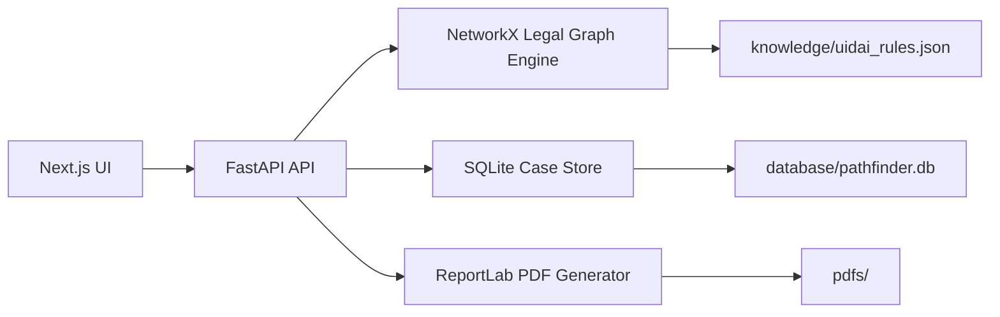

# PathFinder

AI-powered Legal Documentation Navigator for Aadhaar Inclusion.

PathFinder is a complete local hackathon prototype for ASHA workers, government school teachers, NGO caseworkers and legal aid volunteers. It discovers legally valid alternative Aadhaar enrollment pathways, stores cases, and generates working PDF documents.

## Features

- FastAPI backend with Pydantic validation
- Dynamic legal knowledge from `knowledge/uidai_rules.json`
- NetworkX weighted shortest-path legal graph engine
- SQLite case storage with 25 realistic seeded sample cases
- ReportLab PDF generation for declarations, affidavits and verification letters
- Next.js TypeScript frontend with Tailwind CSS, shadcn-style components and Lucide icons
- Dashboard analytics, search, dark mode, print case and export case JSON
- Responsive dashboard, new case workflow and case output pages

## Installation

Install backend dependencies:

```bash
cd backend
pip install -r requirements.txt
```

Install frontend dependencies:

```bash
cd frontend
npm install
```

## Run Backend

```bash
cd backend
uvicorn main:app --reload
```

The API runs at `http://127.0.0.1:8000`.

## Run Frontend

```bash
cd frontend
npm run dev
```

Open `http://localhost:3000`.

## API

- `POST /cases`
- `GET /cases`
- `GET /cases/{id}`
- `POST /generate-path`
- `POST /generate-pdf`
- `GET /rules`
- `GET /stats`

## Architecture



## Folder Structure

```text
frontend/   Next.js app
backend/    FastAPI app
knowledge/  UIDAI legal pathway rules
database/   SQLite database location
pdfs/       Generated PDFs
```

## Screenshots

Add screenshots of the dashboard, new case flow and generated output page after running locally.

## Future Scope

- Replace placeholder circular reference IDs with verified UIDAI circular numbers.
- Add multilingual form labels and printable local-language letters.
- Add offline sync for field workers.
- Add administrator review queues and outcome tracking.
